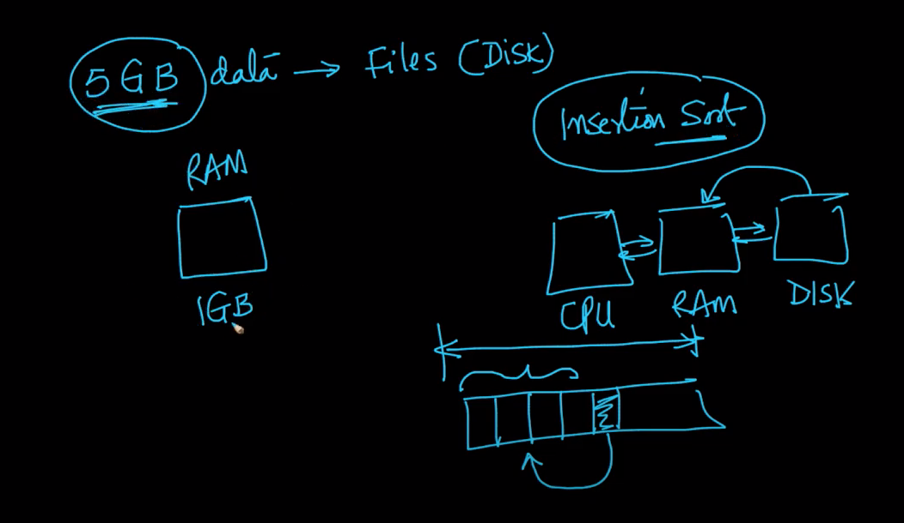
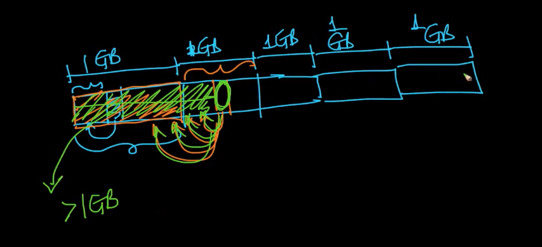

# Asymptotic notations


# Sort Related problems
https://leetcode.com/problems/two-sum/
https://leetcode.com/problems/two-sum-ii-input-array-is-sorted/
https://leetcode.com/problems/3sum/
https://leetcode.com/problems/minimum-swaps-to-group-all-1s-together/
https://leetcode.com/problems/meeting-rooms/

# Merge Sort
https://leetcode.com/problems/merge-intervals/
https://leetcode.com/problems/intersection-of-two-arrays/
https://leetcode.com/problems/intersection-of-two-arrays-ii/
https://leetcode.com/problems/intersection-of-three-sorted-arrays/
https://leetcode.com/problems/merge-sorted-array/
https://leetcode.com/problems/merge-two-sorted-lists/
https://leetcode.com/problems/merge-k-sorted-lists/

# Heap Sort
https://leetcode.com/problems/kth-largest-element-in-a-stream/
https://leetcode.com/problems/find-median-from-data-stream/
# Quick Sort
https://leetcode.com/problems/k-closest-points-to-origin/
https://leetcode.com/problems/top-k-frequent-elements/description/

# Count Sort
https://leetcode.com/problems/sort-colors/description/

# Count Sort on negative number
https://www.ripublication.com/ijaer18/ijaerv13n1_28.pdf

# Dutch Flag Sort
https://leetcode.com/problems/sort-colors/description/

# Selection Sort vs Bubble sort
Due to the similar nature of implementation, these two sorting algorithm sounds the same which cause confusion.

Following are similarities
1. Both sorting algorithm place ith sorted element on ith iteration.
2. Both are the brute force algorithm
3. Technically both algorithm selects ith sorted element on ith iteration, the only difference is how they discover it.
4. Both are in place algorithm.

Following are differences
1. Selection sort selects ith sorted element iterating from left to right.
2. Bubble sort bubble out ith sorted element iterating from right to left by comparing two elements.
3. Selection sort finds out ith sorted element and swap with the current ith element.
4. Bubble sort simply bubbles out the smallest element in each iteration. It has no relation to the current ith element.
5. Since bubble sort maintains the order of an element, therefore, it is stable sort compare to Selection sort which is an unstable sort.

# Insertion sort vs Bubble sort
Due to the same nature to bubble element, these two sorting algorithm sounds the same which cause confusion.

Following are similarities
1. Both sorting algorithms do scanning from right to left
2. Both sorting algorithms try to bubble out element
3. Both are in place algorithm.

Following are differences
1. Insertion sort is based on the assumption that if the array is already sorted then how to insert the new item.
2. Bubble sort doesn't assume that array is already sorted
3. Due to the nature of the insertion sort, it can be written recursively.
4. Insertion sort try to bubble out new element to its correct position in sorted array.
5. Bubble sort tries to bubble out the new smallest element and place it to the first position in the context of the array start position.

# Merge sort
- It is based on assumption that merging two sorted arrays are faster.
- It also assumes that array with single element is already sorted.
- This is not in place algorithm i.e. it needs additional storage to store merged sorted array and then copy back into original array
- This is recursive in nature


 
# External Merge Sort
https://www.youtube.com/watch?v=Bp7fGofslng
https://www.youtube.com/watch?v=ATK74YSzwxg&t=130s

Q. 5GB of data in file on disk with 1GB RAM, how you can sort it?
- Can't load whole 5GB data into RAM therefore can't apply standard algorithm. 

    - You can load 1GB data and sort it
    - But you can't load next 1GB data and perform comparison to sort 2GB data
    - If you keep loading sorted data from disk for comparison then it will take forever time using insertion sort
    
How can we leverage merge sort to solve this problem?
1. Step1:
    - Break 5GB data into 1GB data of separate file
      
    - Load each file in RAM, sort it using any of the standard algorithm and then write into separate file on disk
        
2. Step2:
    - Take 150MB data from each file and load into RAM
    - It will consume total of 750MB of RAM
    - It will have 250MB left on RAM
    
    - Different type of merge sort
        - Standard 2 way merge sort
        
        - 3 way merge sort
        
    - Perform `5` way merge on 5 array and keep writing into remaining `250MB` left RAM
    
    - Once `250GB` RAM is full write into disk and free up spaces
    
    - Once any of `5` merge pointer `i` reached to end then load next batch of `150MB` of data from that file and reset pointer variable
    
    - Keep doing it until file data is exhausted 
    - Every time `250GB` RAM get full and data is written on disk with separate file name.
    

External merged sort is used when data can't be fit in memory. 


# Sort Big File
Imagine you have a 200 GB file with one string per line. Explain how you would sort the file. You cannot bring all the data into memory.


# Quick sort
It is based on partitioning array into following three parts 
1. First part with all elements less than second part
2. Second part has all equal elements greater than first part
3. Third part has all elements greater than second part

Following are few important points
- This algorithm pick random element and place it to its correct position
- There are three partitions algo
a. Lomuto partition - proceed from left to right in single direction
b. Tony Hore - Proceed from both direction until both pointers crossed each other.
c. Three way partitioning
https://algs4.cs.princeton.edu/lectures/demo/23DemoPartitioning.pdf
# Heap Sort
Heap sort is based on following
- Priority Queue
- Build heap from given array
- Get max from heap and swap with last element of array and then apply heapify on root with reduced heap size
# Counting sort
- Perform best if numbers are in small range
- Doesn't do comparison, instead does count numbers as per predefined range and then print it back as per predefined ordered range

# Redix sort
- It is based on stable sorting
- It first starts with right most digit and apply counting sort then move to next digit towards left.
# Bucket sort
https://www.geeksforgeeks.org/bucket-sort-2/
https://www.programiz.com/dsa/bucket-sort
- useful when input is uniformly distributed over a range
- Example
    - Sort a large set of floating point numbers which are in range from 0.0 to 1.0 and are uniformly distributed across the range. 
    - Counting sort can not be applied here as we use keys as index in counting sort.
- Algo
```


1) Create n empty buckets (Or lists).
2) Do following for every array element arr[i].
    a) Insert arr[i] into bucket[n*array[i]]
3) Sort individual buckets using insertion sort.
4) Concatenate all sorted buckets.
```
# Inversion
https://www.youtube.com/watch?v=owZhw-A0yWE
https://www.hackerrank.com/challenges/ctci-merge-sort/problem
https://leetcode.com/problems/global-and-local-inversions/


