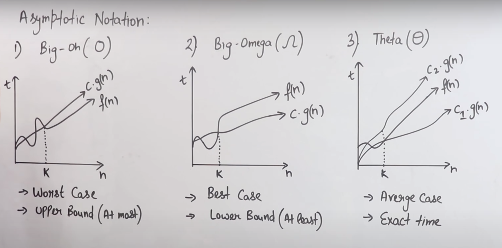

# Asymptotic notations

# Sorting Related problems
https://leetcode.com/problems/two-sum/
https://leetcode.com/problems/two-sum-ii-input-array-is-sorted/
https://leetcode.com/problems/3sum/
https://leetcode.com/problems/4sum/
https://leetcode.com/problems/minimum-swaps-to-group-all-1s-together/

# Merge Sort
https://leetcode.com/problems/intersection-of-two-arrays/
https://leetcode.com/problems/intersection-of-two-arrays-ii/
https://leetcode.com/problems/intersection-of-three-sorted-arrays/
https://leetcode.com/problems/merge-sorted-array/
https://leetcode.com/problems/merge-two-sorted-lists/

# Heap Sort
https://leetcode.com/problems/kth-largest-element-in-a-stream/
https://leetcode.com/problems/find-median-from-data-stream/
https://leetcode.com/problems/distant-barcodes/

# Quick Sort
https://leetcode.com/problems/k-closest-points-to-origin/
https://leetcode.com/problems/top-k-frequent-elements/description/

# Count Sort
https://leetcode.com/problems/sort-colors/description/

# Count Sort on negative number
https://www.ripublication.com/ijaer18/ijaerv13n1_28.pdf

# Dutch Flag Sort
https://leetcode.com/problems/sort-colors/description/

# Sort Big File
Imagine you have a 200 GB file with one string per line. Explain how you would sort the file. You cannot bring all the data into memory.

# External Merge Sort
https://leetcode.com/problems/merge-k-sorted-lists/

# Radix sort

# Bucket sort
https://leetcode.com/problems/car-pooling/

# Inversion
https://www.youtube.com/watch?v=owZhw-A0yWE
https://www.hackerrank.com/challenges/ctci-merge-sort/problem
https://leetcode.com/problems/global-and-local-inversions/

# Wiggle sort
https://leetcode.com/problems/wiggle-sort
https://leetcode.com/problems/wiggle-sort-ii/

# Intervals
https://leetcode.com/problems/meeting-rooms/
https://leetcode.com/problems/meeting-rooms-ii/
https://leetcode.com/problems/merge-intervals/
https://leetcode.com/problems/insert-interval/
https://leetcode.com/problems/interval-list-intersections/
https://leetcode.com/problems/employee-free-time/

